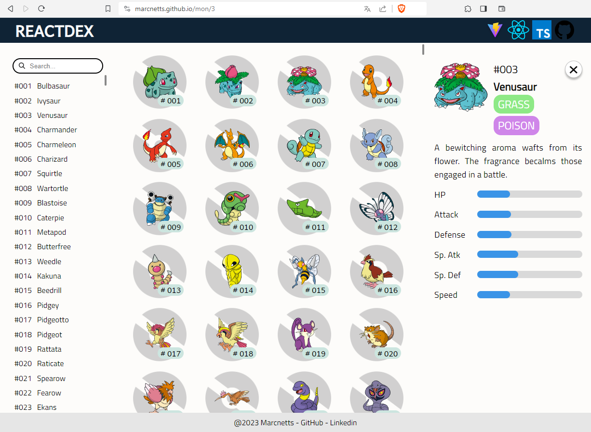

# Reactdex
Vite + React + Typescript + PokéAPI app.

https://marcnetts.github.io/

## Running the app
1. Run `npm install` in a terminal to get its dependencies.
2. `npm run dev` will run the app in your end, usually at `http://localhost:5173/`.
3. `npm run deploy` can submit the app to GitHub Pages, as long the repo is set to your fork and you change the `homepage` value in preferences.json.

## Asset credits
Favicon from [Iconfinder](https://www.iconfinder.com/icons/3151571/pokedex_video_game_icon).

Pokéball background from [Trainer Card Maker](https://tcm.pokecharms.com/modern).
